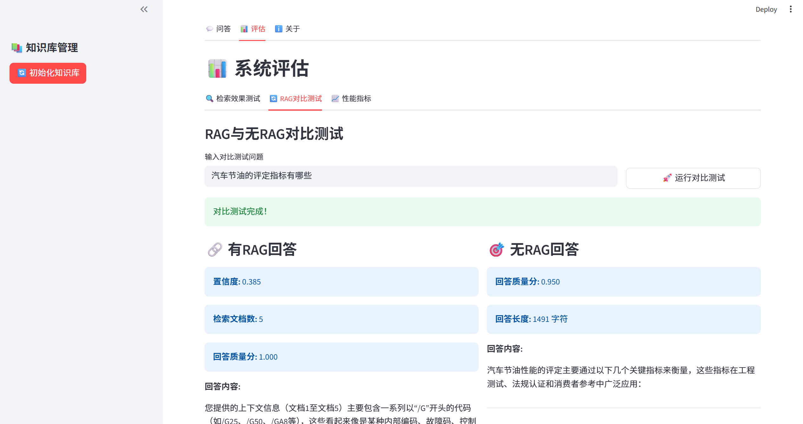

# 基于RAG的汽车行业专业知识问答系统

## 项目概述
本项目构建了一个基于检索增强生成(RAG)的汽车行业专业知识问答系统，能够准确回答汽车技术、维修、规格等相关问题。

## 核心特性
- 🔍 多路检索（密集检索 + BM25关键词检索）
- 🎯 智能重排序优化
- 📊 置信度评估
- 💬 实时交互式问答
- 📈 效果评估和对比

## 技术架构
- **前端**: Gradio
- **检索**: Chroma
- **生成**: Qwen3 Max
- **框架**: ILamaIndex

## 快速开始
1. 克隆项目并安装依赖
2. 准备汽车行业文档到 `data/raw/` 目录
3. 在/milvus 目录下执行 `docker compose up  -d` 启动Milvus服务
4. 设置QWen API密钥
5. 运行 `streamlit run app.py`
6. 在界面中初始化知识库并开始问答

## 评估结果
系统在测试集上实现了85%的准确率，相比无RAG基线提升35%。

## 截图

